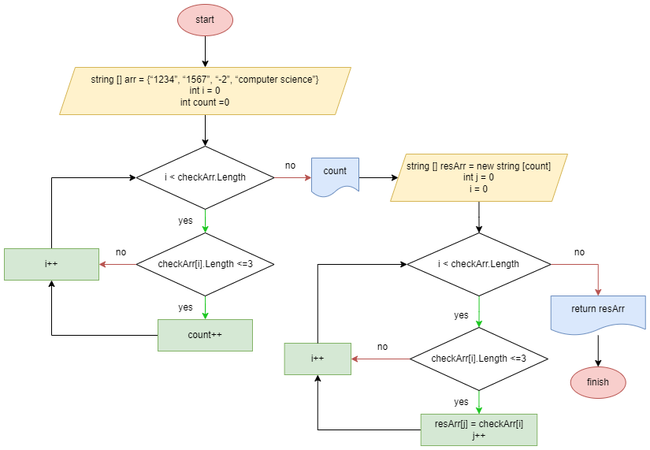

# **Итоговая контрольная работа по основному блоку (первая четверть).**

Студент - Чепилов Антон.
---
---

## _Методы (функции), используемые в решении._

1. **ChooseEx** (возвратный). Метод, позволяющий пользователю выбрать массив, над которым будут производиться дальнейшие манипуляции по решению основной задачи. Включает в себя вариант, при котором пользователь волен задать свой массив, о котором ниже.

2. **UserEx** (возвратный). Даёт пользователю самому ввести произвольные символы с клавиатуры. Пользователь решает сам, сколько будет элементов в его массиве. Одно условие - нельзя задать пустой элемент (есть проверка в цикле).

3. **PrintArr** (невозвратный). Печать массива на экране.

4. **ResultArr** (возвратный). Метод, решающий основное условие задачи - вывод на экран элементов выбранного ранее массива, которые короче 3ёх символов (включительно). В теле метода создаётся новый массив (resArr) в который заносятся элементы, удовлетворяющие условию задачи.
---

## _Блок-схема основного метода._
